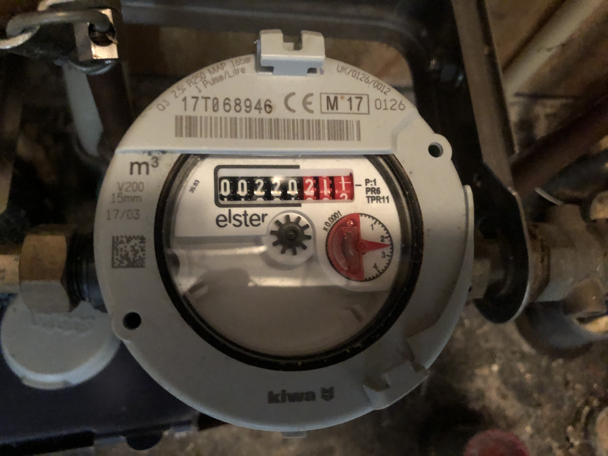
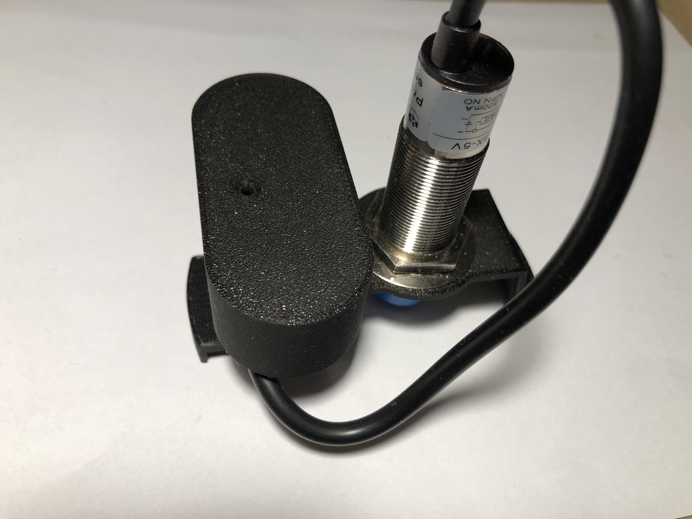
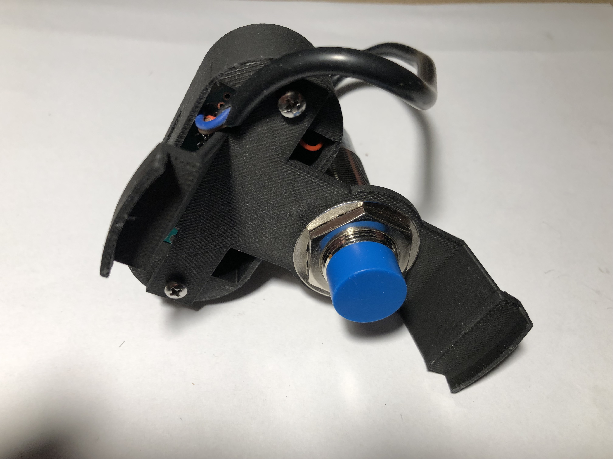

# ESP32 Water Genie

A smart water meter monitoring system built for the ESP32-S3 that tracks water consumption using a pulse-based sensor and provides remote access via Telnet.

## Overview

ESP32 Water Genie monitors water consumption by detecting pulses from a water meter's indicator using an optical or magnetic probe. The system logs timestamped readings and provides a command-line interface over Telnet for configuration and data retrieval.
It uses the position of the back of the red arrow of the watermeter to detect that another litre of water has been used.





## Features

- **Real-time Water Monitoring**: Tracks water consumption with pulse detection (2 pulses per liter)
- **NTP Time Synchronization**: Automatically syncs with NTP servers for accurate timestamps
- **Data Logging**: Stores timestamped water consumption data
- **Telnet Interface**: Remote command-line access for monitoring and configuration
- **Visual Feedback**: RGB LED indicates sensor status and system activity
- **WiFi Connectivity**: Connects to your local network for remote access

## Hardware Requirements

- ESP32-S3 development board with RGB LED
- Water meter pulse sensor (optical or magnetic)
- Sensor connected to GPIO pin 4

## Pin Configuration

| Pin | Function |
|-----|----------|
| GPIO 4 | Water meter probe input |
| Built-in RGB LED | Status indicator |

## Installation

1. Clone this repository
2. Install required Arduino libraries:
   - WiFi (ESP32 core)
   - esp_system (ESP32 core)
3. Prepare your compiler for esp32s3 compilation:
    - Copy the files described in directory extra_platformio_board.
4. Compile using visual studio code for the esp32s3 target using 'Upload and monitor' in PlatformIO.
5. open a cmd windows and execute telnet to the ip address shown in your serial log of visual code.

## Usage

### Initial Setup

1. Power on the ESP32-S3
2. The device will connect to WiFi and display its IP address on the serial monitor
3. System time will automatically sync with `nl.pool.ntp.org`

### Connecting via Telnet

```bash
telnet <ESP32_IP_ADDRESS>
```

You'll be greeted with:
```
Welcome to project ESP32_Water_Genie
ESP32>
```

### Available Commands

| Command | Description |
|---------|-------------|
| `led on` | Turn on the RGB LED (green) |
| `led off` | Turn off the RGB LED |
| `help` | Display help information |
| `reset` | Perform a hard reset of the ESP32-S3 |
| `set <value>` | Set the current water meter reading |
| `get` | Display the current water meter reading |
| `time` | Display current date and time |
| `clear` | Clear the water log |
| `log` | Display logged water meter values with timestamps |

### Example Session

```
ESP32> get
Meter value: 1523

ESP32> time
2025-10-19 14:32:45

ESP32> log
[CSV output of timestamped readings]

ESP32> set 1500
ESP32> get
Meter value: 1500
```

## How It Works

### Pulse Detection

- The system monitors GPIO pin 4 for changes in the probe state
- Each transition (high to low or low to high) represents a pulse
- Two pulses equal one liter of water consumption
- The RGB LED flashes blue when the sensor detects the meter indicator

### Data Logging

- Each time the meter reading increments by one liter, a timestamped entry is logged
- Logs can be retrieved in CSV format via the `log` command
- Logs can be cleared using the `clear` command

### Time Synchronization

- On startup, the system connects to `nl.pool.ntp.org`
- Time zone is set to GMT+1 with automatic DST adjustment
- Timestamps use the format: `YYYY-MM-DD HH:MM:SS`

## LED Status Indicators

| Color | Status |
|-------|--------|
| Blue (flashing) | Water meter pulse detected |
| Green | LED manually turned on via command |
| Off | Normal operation / LED turned off |

## Network Configuration

- Protocol: Telnet (port 23)
- WiFi Mode: Station (STA)
- Single client connection supported

## Troubleshooting

**Cannot connect via Telnet**
- Verify the ESP32-S3 is connected to WiFi (check serial monitor)
- Ensure you're on the same network
- Try pinging the ESP32's IP address

**Time not syncing**
- Check internet connectivity
- Verify NTP server is accessible
- The system retries up to 10 times on startup

**Pulse detection not working**
- Verify sensor is connected to GPIO 4
- Check sensor power supply
- Ensure sensor is properly positioned near the water meter indicator

**Incorrect readings**
- Use the `set` command to calibrate the current meter reading
- Readings are stored as pulses (2 per liter) internally

## Technical Details

- **Pulse Resolution**: 0.5 liters (2 pulses per liter)
- **Scan Rate**: 10 Hz (probe checked 10 times per second)
- **Serial Baud Rate**: 115200
- **Time Zone**: GMT+1 (Central European Time) with DST

## Contributing

This project uses a custom command parser built with Flex/Bison. Contributions should maintain compatibility with the existing command structure.

## License

See license.txt.

## Author

Rob vd Ouderaa (rouderaa@hccnet.nl)

## Acknowledgments

- NTP time synchronization using ESP32 time libraries
- Telnet server implementation based on ESP32 WiFi libraries
